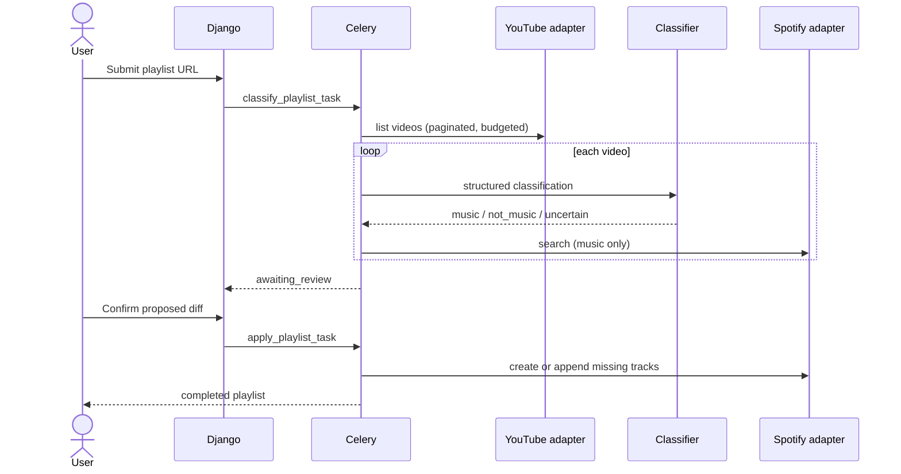

# Sync

Sync converts YouTube playlists into **reviewable** Spotify playlists through an asynchronous Django/Celery pipeline. Provider integrations are isolated behind typed adapters, AI classification uses validated structured outputs, and retry-safe jobs expose progress, cost and failure behaviour without requiring live credentials for the demo.




`make demo` runs the same flow against deterministic fixtures: five videos covering a hit, a cover, a tutorial, a low-confidence clip and a second match. Three tracks are written to a fake Spotify playlist; non-music and uncertain items stay in review.

## AI boundary

The classifier must return this schema (`song-classification/v1`):

```json
{
  "classification": "music | not_music | uncertain",
  "artist": "string | null",
  "song": "string | null",
  "confidence": 0.0
}
```

Model output is untrusted. Invalid JSON, missing identity for `music`, refusals and timeouts never write to Spotify. Confidence below **0.70** goes to the review queue. Live OpenAI calls are optional; fixture mode is the default.

## Local setup

### 1. Offline fixture mode (recommended)

```bash
git clone https://github.com/VaughnDV/sync.git
cd sync
make install
make demo
```

This uses SQLite, eager Celery and fake YouTube/Spotify/classifier adapters. No API keys.

### 2. Real providers

Copy `.env.example` to `.env`, set `SYNC_PROVIDER_MODE=live`, and add YouTube, Spotify and OpenAI credentials. Spotify scopes are documented in [docs/oauth-scopes.md](docs/oauth-scopes.md): `playlist-read-private` and `playlist-modify-private` only. Tokens are encrypted at rest.

```bash
make compose-up
```

## Quality commands

| Command | Purpose |
| --- | --- |
| `make lint` | Ruff lint and format |
| `make typecheck` | mypy on typed modules |
| `make test` | Unit and failure tests |
| `make test-integration` | Views, CSRF, offline flow |
| `make check-migrations` | `makemigrations --check` |
| `make audit` | pip-audit |
| `make demo` | Recruiter/reviewer offline run |

Health: `GET /health/live/`, `GET /health/ready/`. Metrics: `GET /metrics/`. Operations: [docs/operations.md](docs/operations.md).

## Limits and safeguards

- Max 200 videos per job, 10 minute wall clock, 80 YouTube / 120 Spotify calls, about USD 0.50 of classifier spend.
- Classification never mutates Spotify. Apply appends missing tracks only.
- Retries resume from persisted mappings and write checkpoints.
- User-facing errors are stable codes, not raw SDK text.

## Architecture decisions

See [docs/adr](docs/adr).

## License

MIT. See [LICENSE](LICENSE).
