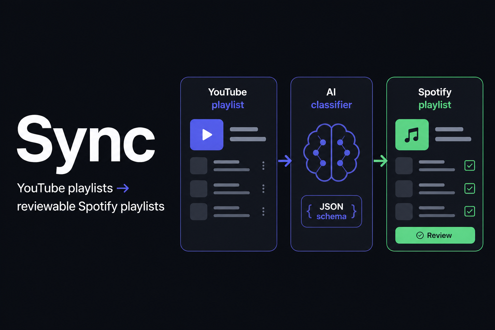
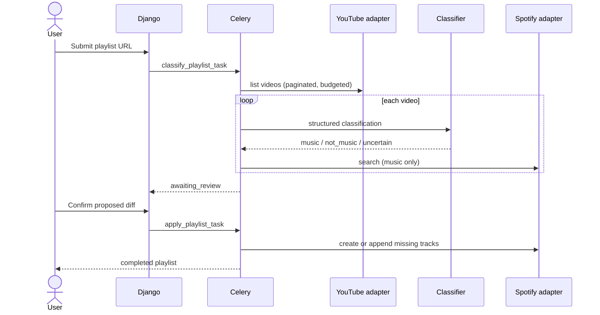

# Sync

[](https://github.com/VaughnDV/sync/actions/workflows/ci.yml)
[](pyproject.toml)
[](https://www.djangoproject.com/download/)
[](https://github.com/astral-sh/ruff)
[](https://github.com/pre-commit/pre-commit)
[](LICENSE)

Convert YouTube playlists into **reviewable** Spotify playlists. Classification, matching and cost stay in a job the user can inspect; Spotify is only written after confirmation.

This repository is a fixture-backed showcase. The default path runs offline with no API keys.



## Features

- **Review first.** Jobs classify and match, then wait. Apply appends missing tracks; it never replaces a playlist.
- **Typed providers.** YouTube, Spotify and the classifier sit behind adapters. `SYNC_PROVIDER_MODE=fake` is the default.
- **Untrusted AI.** Model output must match `song-classification/v1`. Invalid JSON, refusals and low confidence never write to Spotify.
- **Least-privilege OAuth.** Spotify scopes are `playlist-read-private` and `playlist-modify-private` only. Tokens are encrypted at rest.
- **Bounded, retry-safe jobs.** Size, time, request and cost budgets. Checkpoints resume after worker failure.
- **Operable locally.** JSON logs, Prometheus `/metrics/`, liveness/readiness probes, and retention commands.

## How it works



`make demo` runs that flow against five fixture videos: a hit, a cover, a tutorial, a low-confidence clip and a second match. Three tracks land on a fake Spotify playlist; non-music and uncertain items stay in review.

## AI boundary

The classifier must return this schema (`song-classification/v1`):

```json
{
  "classification": "music | not_music | uncertain",
  "artist": "string | null",
  "song": "string | null",
  "confidence": 0.0
}
```

Invalid JSON, missing identity for `music`, refusals and timeouts never write to Spotify. Confidence below **0.70** goes to the review queue. Live OpenAI calls are optional.

## Quick start

Requires Python 3.11+, [Poetry](https://python-poetry.org/) and Make.

```bash
git clone https://github.com/VaughnDV/sync.git
cd sync
make install
make demo
```

That uses SQLite, eager Celery and fake YouTube/Spotify/classifier adapters. No API keys.

### Live providers

Copy `.env.example` to `.env`, set `SYNC_PROVIDER_MODE=live`, and add YouTube, Spotify and OpenAI credentials. Scopes: [docs/oauth-scopes.md](docs/oauth-scopes.md).

```bash
make compose-up
```

Redis, RabbitMQ and Postgres stay on the Compose network; they are not published to the host.

## Layout

```text
src/
  apps/            accounts, dashboard, playlist_sync
  providers/       YouTube, Spotify, classifier + fakes
  core/            logging, metrics, retries
  sync/            Django / Celery settings
tests/             unit, integration, failure
docs/adr/          architecture decisions
scripts/demo.py    one-command offline run
```

## Development

| Command | Purpose |
| --- | --- |
| `make lint` | Ruff lint and format |
| `make typecheck` | mypy on typed modules |
| `make test` | Unit, failure and integration tests (coverage gate 80%) |
| `make test-integration` | Views, CSRF, offline flow |
| `make check-migrations` | `makemigrations --check` |
| `make audit` | pip-audit |
| `make demo` | Offline fixture run |

CI (GitHub Actions) runs quality, the full test suite with coverage on 3.11/3.12, Postgres integration, gitleaks, pip-audit, Trivy and a smoke demo.

Health: `GET /health/live/`, `GET /health/ready/`. Metrics: `GET /metrics/`.

## Documentation

| Doc | Contents |
| --- | --- |
| [docs/adr](docs/adr) | Product and security decisions |
| [docs/oauth-scopes.md](docs/oauth-scopes.md) | Spotify OAuth scopes |
| [docs/operations.md](docs/operations.md) | Health, metrics, recovery, retention |
| [docs/quality.md](docs/quality.md) | Local quality commands |
| [CONTRIBUTING.md](CONTRIBUTING.md) | Setup and PR checks |
| [SECURITY.md](SECURITY.md) | Reporting and baseline |
| [CHANGELOG.md](CHANGELOG.md) | Release notes |

## Limits

- Max 200 videos per job, 10 minute wall clock, 80 YouTube / 120 Spotify calls, about USD 0.50 of classifier spend.
- Classification never mutates Spotify. Apply appends missing tracks only.
- Retries resume from persisted mappings and write checkpoints.
- User-facing errors are stable codes, not raw SDK text.

## Contributing

See [CONTRIBUTING.md](CONTRIBUTING.md). Please report vulnerabilities privately as described in [SECURITY.md](SECURITY.md).

## License

[MIT](LICENSE) © VaughnDV
